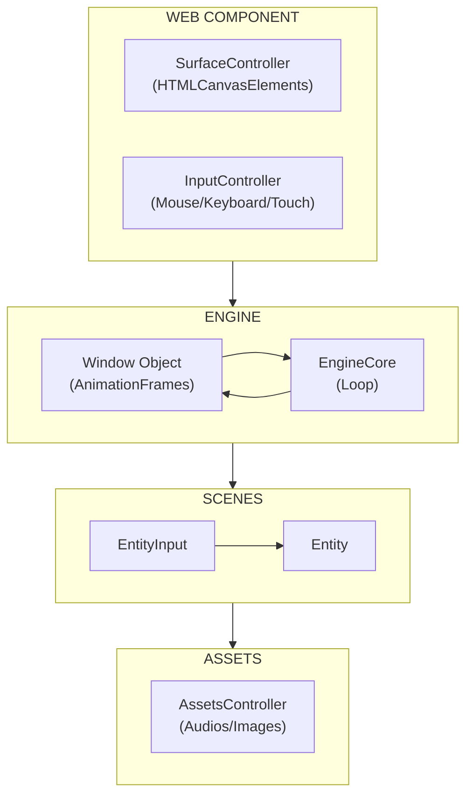

```mermaid
graph TD
ENGINE_WINDOW_OBJECT["Window Object</br>(AnimationFrames)"]
ENGINE_CORE["EngineCore</br>(Loop)"]
CONTROLLER_SURFACE["SurfaceController</br>(HTMLCanvasElements)"]
CONTROLLER_INPUT["InputController</br>(Mouse/Keyboard/Touch)"]
CONTROLLER_ASSETS["AssetsController</br>(Audios/Images)"]
SCENES_ENTITY["Entity"]
SCENES_ENTITY_INPUT["EntityInput"]

subgraph LAYER_WEBCOMPONENT["WEB COMPONENT"]
    CONTROLLER_SURFACE
    CONTROLLER_INPUT
end
subgraph LAYER_ENGINE["ENGINE"]
    ENGINE_WINDOW_OBJECT-->ENGINE_CORE
    ENGINE_CORE-->ENGINE_WINDOW_OBJECT
end
subgraph LAYER_SCENES["SCENES"]
    direction LR
    SCENES_ENTITY_INPUT-->SCENES_ENTITY
end
subgraph LAYER_ASSETS["ASSETS"]
    CONTROLLER_ASSETS
end

LAYER_WEBCOMPONENT-->LAYER_ENGINE
LAYER_ENGINE-->LAYER_SCENES
LAYER_SCENES-->LAYER_ASSETS
```